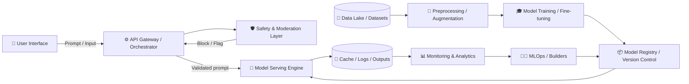

# 🚀 Generative Artificial Intelligence
### 📘 Purpose

This document provides a **complete, visually clear, and beginner-to-expert friendly** guide to understanding **Generative AI** — from both **User** and **Builder** perspectives. It’s designed for GitHub repositories, learning documentation, or AI project blueprints.

---

## 🧩 1. What is Generative AI?

**Generative Artificial Intelligence** refers to systems capable of **creating new content** — text, images, music, code, or videos — by learning from vast datasets. Unlike traditional AI (which classifies or predicts), Generative AI **produces original outputs** inspired by its training data.

### 🎯 Key Abilities:

* Text generation (ChatGPT, Claude, Gemini)
* Image generation (DALL·E, Midjourney, Stable Diffusion)
* Code generation (GitHub Copilot, Code Llama)
* Audio & Video generation (Synthesia, Suno, Runway)

---

## 🧠 2. Generative AI System Architecture

### 🔍 Overview

Generative AI consists of **three major layers**:

| Layer             | Description                                          | Examples                               |
| ----------------- | ---------------------------------------------------- | -------------------------------------- |
| **Data Layer**    | Collects, cleans, and preprocesses data for training | Web data, datasets, labeling pipelines |
| **Model Layer**   | Training, fine-tuning, and deploying AI models       | Transformers, Diffusion, VAEs, GANs    |
| **Serving Layer** | Interfaces for users, APIs, safety, and monitoring   | Web apps, APIs, moderation systems     |

---

## 🧭 3. Generative AI Architecture Diagram

